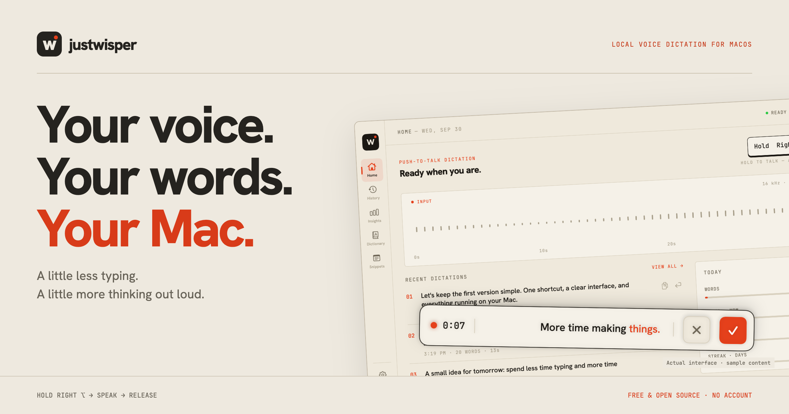
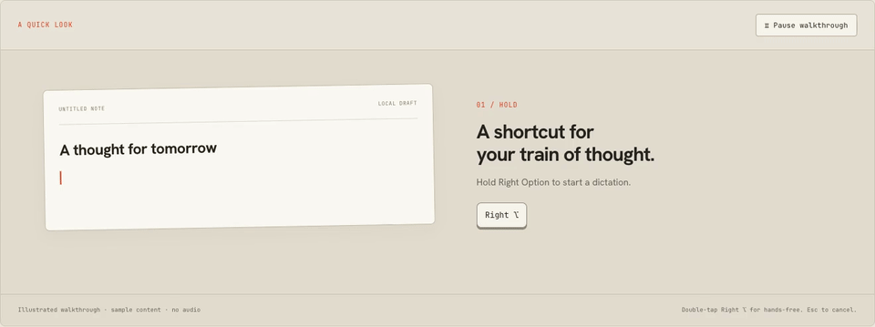
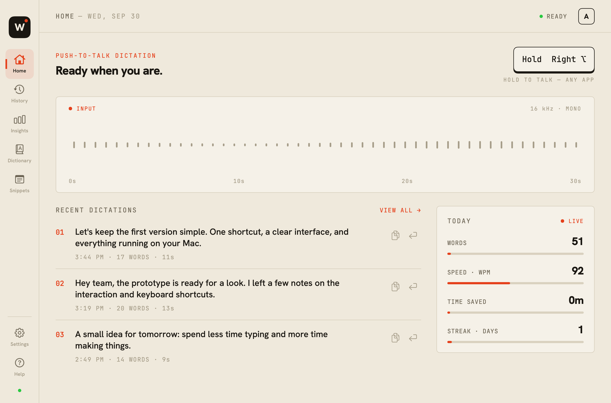
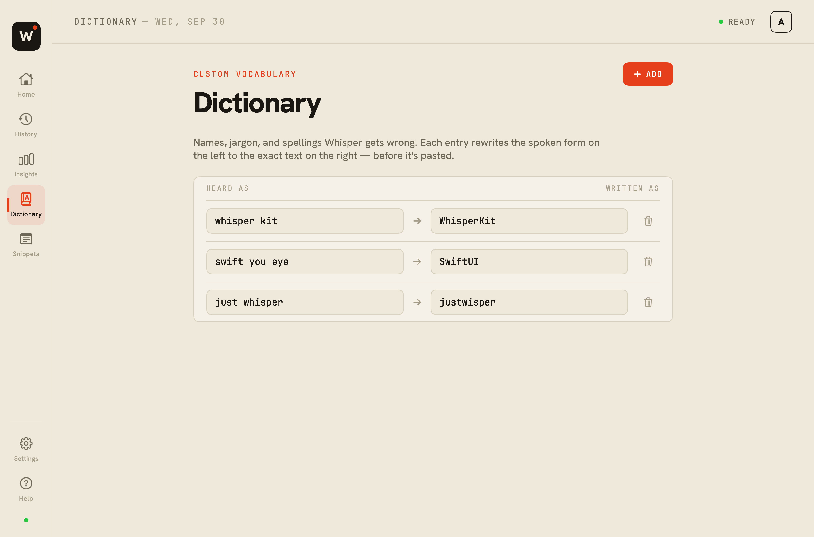
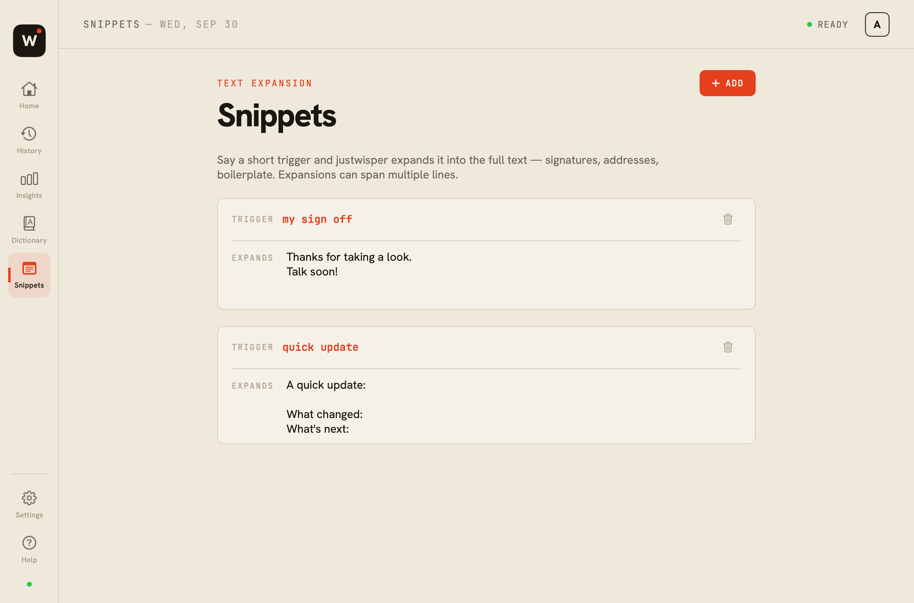
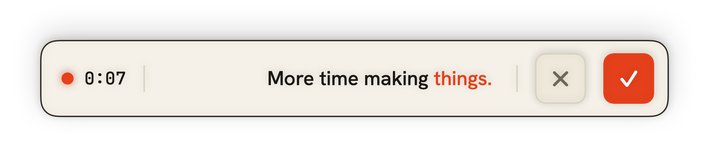
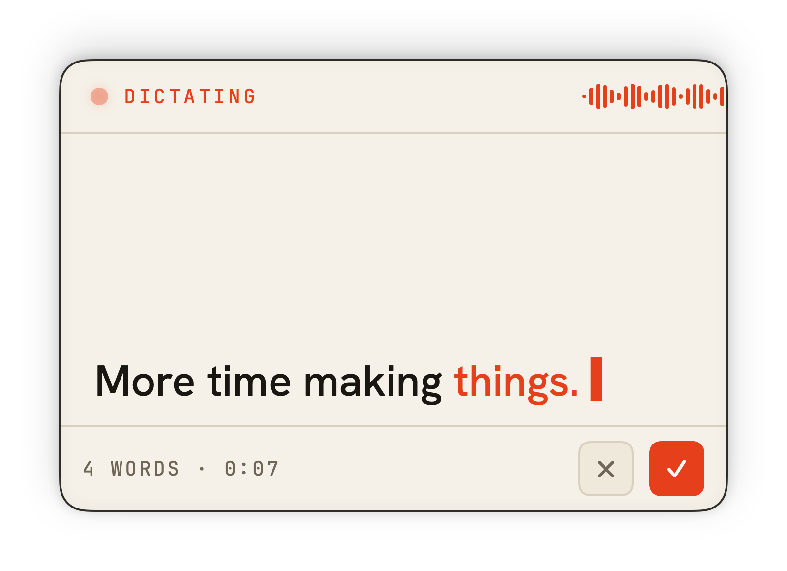

<p align="center">
  
</p>

<p align="center">
  <strong>A little less typing. A little more thinking out loud.</strong><br>
  Free, open-source dictation for your Mac. Hold Right Option, speak, and release to insert your words.
</p>

<p align="center">
  <a href="https://github.com/dhirajcdry/justwisper/releases/tag/v0.2.0"><strong>Download for macOS ↓</strong></a> ·
  <a href="#see-it-in-action">See it in action</a> ·
  <a href="#get-started">Get started</a> ·
  <a href="CONTRIBUTING.md">Contribute</a>
</p>

<p align="center">Apple Silicon · macOS 14+ · SwiftUI · MIT license · Early release</p>

---

## The idea

You already have somewhere to write. justwisper gives you another way to get the words there.

Focus a text field, hold **Right ⌥**, and talk. A small floating bar follows along. Release the key and the final transcript is inserted into the app you were using. Double-tap for hands-free dictation.

Speech recognition runs **on your Mac** using [WhisperKit](https://github.com/argmaxinc/argmax-oss-swift) and Core ML. There’s no account, subscription, or app telemetry. Models and tokenizer files download during setup; once cached, dictation works offline.

## See it in action



*Illustrated walkthrough with sample content, not a recording-speed benchmark. [Download the short MP4](site/assets/walkthrough.mp4).*

<details>
<summary><strong>A closer look at the actual app</strong></summary>

### Your workspace



### Your vocabulary and snippets

| Teach it your words | Expand the things you say often |
| --- | --- |
|  |  |

### A floating bar that fits your workflow

| Galley — compact | Column — room to think |
| --- | --- |
|  |  |

Ticker and Proof are also available in Settings. All four styles can be repositioned.

*These images render the real SwiftUI views with fictional data. No personal dictation history is included. [How the assets are made](docs/ASSETS.md).*

</details>

## What’s inside

- **Hold or go hands-free.** Hold Right Option for push-to-talk; double-tap to keep recording.
- **Live previews.** Follow recent words while speaking. The final pass processes the entire take.
- **Local history.** Copy or reinsert a previous dictation. Erase history from Insights.
- **Your vocabulary.** Map spoken terms to names, spellings, and project jargon.
- **Spoken shortcuts.** Expand a short trigger into a saved phrase or multi-line snippet.
- **Formatting controls.** Rule-based cleanup, voice commands, and per-app formatting modes. Optional on-device AI polish uses Apple Intelligence on supported macOS 26+ Macs and is off by default.
- **Recoverable cancellation.** Esc cancels; the short undo window can recover an accidental cancellation.
- **Four overlay styles.** Galley, Column, Ticker, and Proof, with a draggable position.

## Get started

1. **Download** the DMG from [GitHub Releases](https://github.com/dhirajcdry/justwisper/releases/tag/v0.2.0). Open it and drag **justwisper** into **Applications**.
2. **Open the app.** Community builds are ad-hoc signed and **not notarized**. If macOS blocks the first launch, go to **System Settings → Privacy & Security → Open Anyway** after trying to open it. Only approve a download you trust. [Apple’s first-launch guide](https://support.apple.com/en-us/102445).
3. **Grant Microphone and Accessibility.** Microphone captures your voice; Accessibility enables the global shortcut and insertion into other apps.
4. **Let the model finish setting up.** Base is the default. First setup needs internet for the model and tokenizer files; later launches reuse them.
5. **Focus a text field. Hold Right ⌥, speak, then release.**

If the supported first-launch flow doesn’t work, see [Troubleshooting](docs/TROUBLESHOOTING.md). Release assets include a SHA-256 checksum so you can verify the downloaded file.

### The shortcuts

| Action | Shortcut |
| --- | --- |
| Push-to-talk | Hold **Right ⌥**; release to finish |
| Hands-free | Quickly double-tap **Right ⌥**; tap once to finish |
| Cancel | **Esc** or the overlay’s **×** |
| Recover a cancelled take | **Undo** during the brief recovery window |
| Move the overlay | Drag it |
| Reset overlay position | Double-click the overlay, or reset it in Settings |

The trigger is the **right-hand Option key**, not the right mouse button. Keep the app running in the menu bar to keep the model in memory.

### Choose a model

| Model | Language | Best starting point for |
| --- | --- | --- |
| Tiny | English | The smallest model and lighter inference work |
| **Base** · default | English | Everyday dictation |
| Small | English | Trying a larger English model when Base misses words |
| Turbo | Multilingual | Dictating in languages beyond English |

Model download sizes and speed vary by variant. The app shows an estimated size before selection. Your selection survives relaunches. A full quit unloads the model from memory; reopening loads the cached files again.

## Privacy, plainly

Audio is captured in memory and processed locally. The app does not intentionally save audio recordings to disk. Completed transcript history, vocabulary, snippets, and per-app formatting rules are stored under `~/Library/Application Support/Wispr/`.

Insertion first uses macOS Accessibility. A clipboard-based paste is the fallback, so clipboard managers may see that text. The destination app controls what happens to text after insertion. Current builds log word counts and timings rather than transcript text. Older logs can contain transcripts; review diagnostics before sharing.

[Read the storage and network details →](docs/PRIVACY.md)

## Current limits

This is an early release, not a promise of perfect recognition. Accuracy depends on the model, language, microphone, and background noise. Apple Silicon is the supported release target; Intel builds are not part of the tested distribution.

Some apps and secure text fields block automatic insertion. Copy the completed transcript from History if needed. The interface’s live preview shows recent audio; the final transcript includes the complete take. Apple Intelligence polish requires a compatible Mac and an available system model.

Found a rough edge? [Report it](https://github.com/dhirajcdry/justwisper/issues/new?template=bug_report.yml) with your Mac, macOS version, app version, and reproduction steps. Please remove personal transcript text from logs.

## Build from source

```bash
git clone https://github.com/dhirajcdry/justwisper.git
cd justwisper
./build.sh
open ./justwisper.app
```

Building requires **Swift 6.2+ (Xcode 26+)** because of the locked dependencies; running the app still targets macOS 14+. To retain local permissions across rebuilds, run `./setup-signing.sh` once before building. This creates a local development identity; it is not Apple Developer ID signing or notarization.

```bash
swift test                 # regression suite; no microphone required
./package.sh               # Apple Silicon DMG in dist/
```

The real-model smoke test and screenshot renderer are opt-in. See [Contributing](CONTRIBUTING.md), [asset generation](docs/ASSETS.md), and the [release guide](docs/RELEASING.md).

## Built to be understood

The app is native SwiftUI, with a small set of focused components:

```text
Right Option → gesture state → mic capture → WhisperKit → cleanup → text insertion
                                   │                         │
                              live preview              local history
```

Start with [AppModel.swift](Sources/Wispr/AppModel.swift) for orchestration, [HotkeyMonitor.swift](Sources/Wispr/HotkeyMonitor.swift) for gestures, and [WhisperEngine.swift](Sources/Wispr/WhisperEngine.swift) for the local inference pipeline.

For help, see [Support](SUPPORT.md). For planned work, see the [Roadmap](ROADMAP.md). Please follow our [community conduct](CODE_OF_CONDUCT.md).

Contributions that make the everyday dictation loop more reliable are especially welcome. [The contributor guide](CONTRIBUTING.md) explains how to build, test, and send a change.

---

Built by [Dhiraj Chaudhary](https://github.com/dhirajcdry). App code is [MIT licensed](LICENSE); dependencies, models, and fonts retain their own licenses. [Third-party notices](THIRD_PARTY_NOTICES.md).

justwisper is an independent project inspired by push-to-talk dictation. It is not affiliated with Wispr Flow, Apple, or OpenAI.
